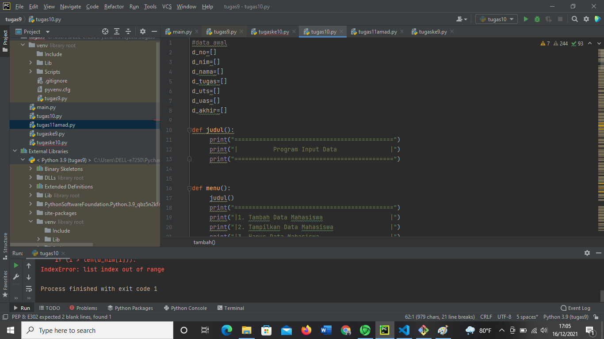
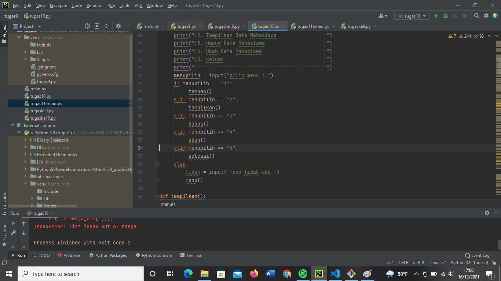
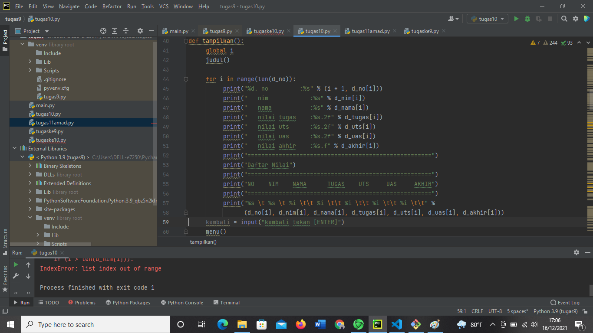
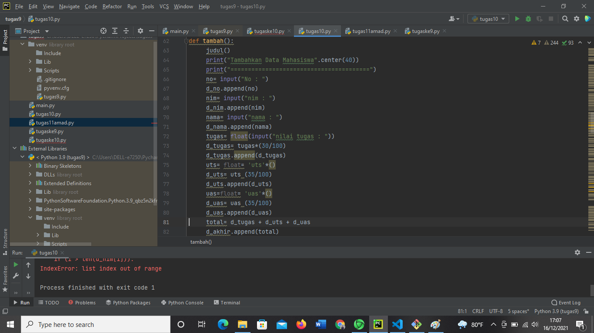
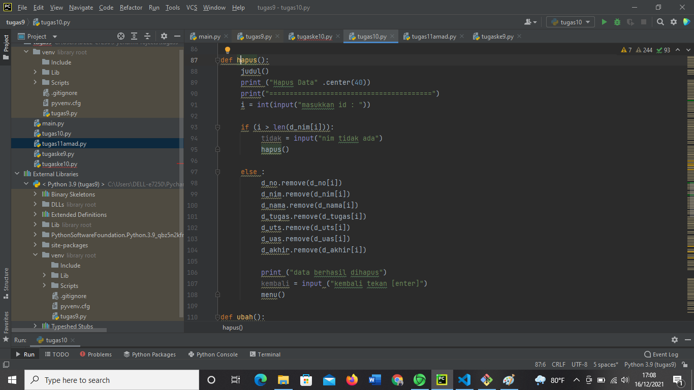
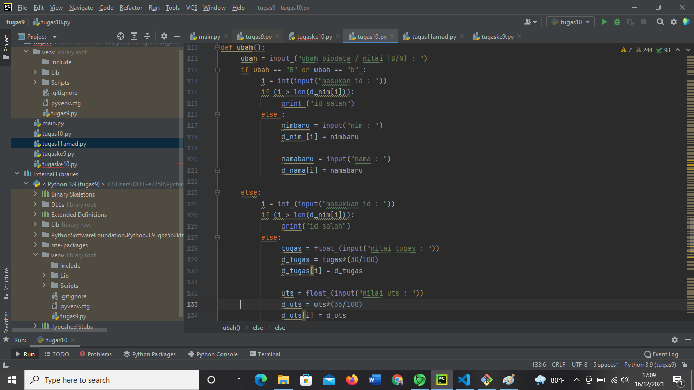
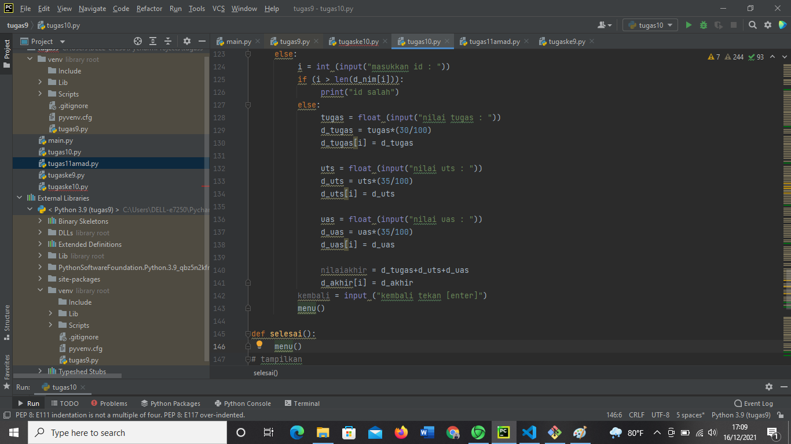
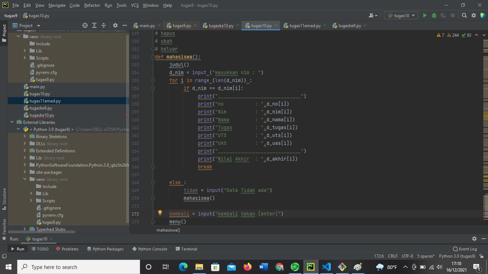
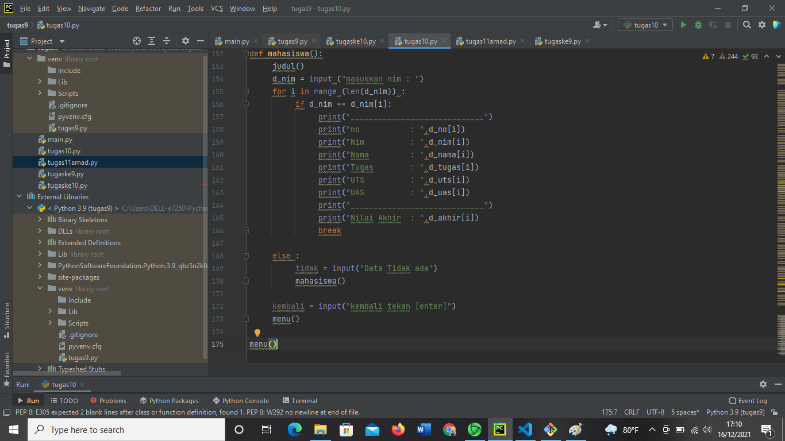

# program1uas
## nama :amad sumadi
### nim 31211025
#### kelas : TI.21.CA1

##### berikutadalah rangkuman dari tugas uas kali ini
1. berikut adalah soalnya

dan berikut contoh yang dimaksud
 

